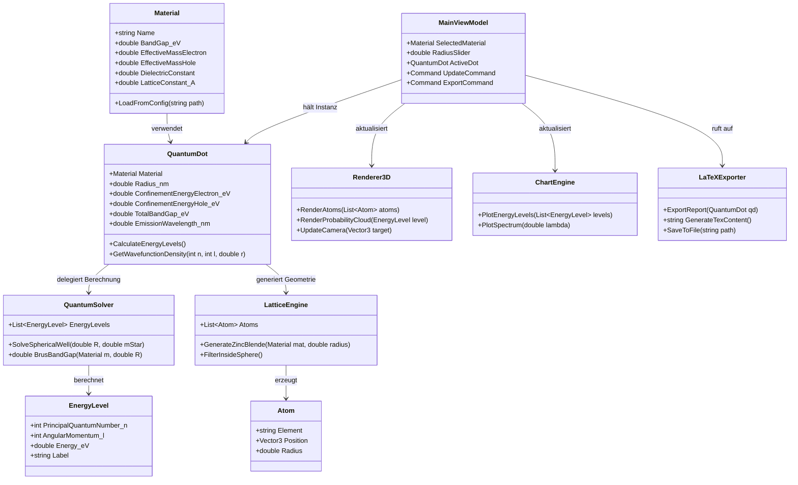

# UML-Klassendiagramm: Quantum Dot Studio

## Architektur-Erklärung

| Schicht | Klassen | Aufgabe |
|---------|---------|---------|
| **Domain** | `Material`, `QuantumDot`, `EnergyLevel`, `Atom` | Reine Datenmodelle mit physikalischer Logik |
| **Core/Services** | `QuantumSolver`, `LatticeEngine` | Berechnungsalgorithmen, unabhängig von UI |
| **Infrastructure** | `Renderer3D` (Helix Toolkit), `ChartEngine` (OxyPlot), `LaTeXExporter` | Technologie-spezifische Ausgaben |
| **Presentation (MVVM)** | `MainViewModel` | Vermittlung zwischen UI und Core, Data-Binding |

### Wichtige Designentscheidungen

- **Material ist immutable**: Alle Parameter werden per Konfiguration geladen und sind zur Laufzeit konstant.
- **QuantumSolver ist zustandslos**: Eingabe (R, m*) -> Ausgabe (Energieliste). Ermöglicht Unit-Testing und Wiederverwendung.
- **LatticeEngine trennt Erzeugung von Filterung**: Zuerst wird das unendliche Gitter erzeugt, dann auf die Kugel beschnitten. Das erleichtert spätere Erweiterung auf andere Formen (Würfel, Ellipsoid).
- **LaTeXExporter kapselt Template-Logik**: Die `.tex`-Generierung ist vollständig von der Berechnung entkoppelt.
