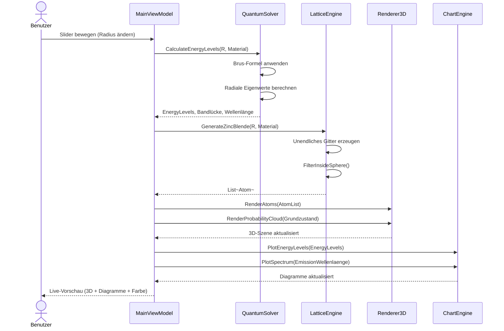

# UML-Sequenzdiagramm: Radius-Änderung

## Beschreibung der Interaktion

1. **Trigger**: Der Benutzer bewegt den Radius-Slider in der WPF-UI.
2. **Berechnung**: Das ViewModel ruft den `QuantumSolver` auf, der für den neuen Radius die Energieniveaus (Brus-Korrektur) und Emissionswellenlänge berechnet.
3. **Geometrie**: Parallel wird der `LatticeEngine` aufgerufen, der ein neues sphärisches Gitterstück generiert.
4. **Visualisierung**: `Renderer3D` zeichnet Atome und Wahrscheinlichkeitswolke neu. `ChartEngine` aktualisiert Energieniveau-Balken und Spektrum.
5. **Feedback**: Der Benutzer sieht alle drei Darstellungen (3D-Struktur, Energiediagramm, Emissionsspektrum) in Echtzeit aktualisiert.

## Parallelisierung

Der Berechnungsprozess (Solver + LatticeEngine) läuft synchron im UI-Thread innerhalb von <200 ms. Bei Bedarf könnte ein `Task.Run` die Berechnung in den Hintergrund verlagern und das Ergebnis per `Dispatcher`-Rückruf zurückliefern. Für den vorliegenden Scope (R ≤ 10 nm, ~1000 Atome) ist keine Asynchronität nötig.
